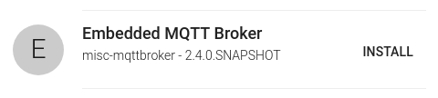
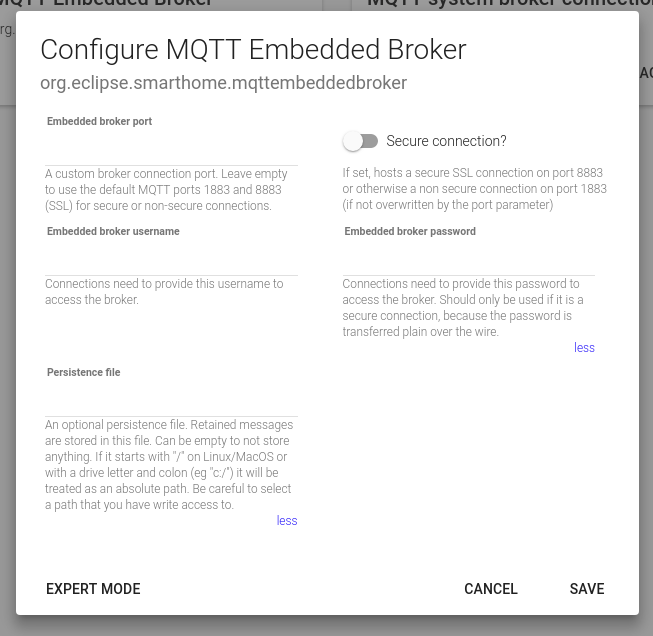
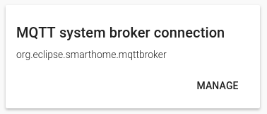
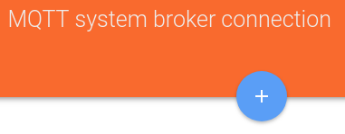

# MQTT Arrives in the Modern openHAB 2.x Architecture

If you haven't heared about MQTT yet, it is probably time to have a [look](https://en.wikipedia.org/wiki/MQTT). Quoting Wikipedia here:

> "MQTT (Message Queuing Telemetry Transport) is an ISO standard (ISO/IEC PRF 20922)[2] publish-subscribe-based messaging protocol. It works on top of the TCP/IP protocol. It is designed for connections with remote locations where a "small code footprint" is required or the network bandwidth is limited."

The Publish/Subscribe pattern is event-driven and enables messages to be pushed to clients.
The central communication point is the MQTT broker, it is in charge of dispatching all messages between the senders and the rightful receivers.
A client that publishes a message to the broker, includes a topic into the message.
The topic is used as the routing information for the broker.
Each client that wants to receive messages subscribes to one or more topics and the broker delivers all messages with the matching topic to the client.

A topic is a simple string that can have more hierarchy levels, which are separated by a slash.
A sample topic for sending temperature data of the living room could be **house/living-room/temperature**.

In recent years MQTT got a lot of attention for IoT and home automation purposes.
Propably mainly because of the simplicity of the protocol and its many client and server implementations, desktop and embedded, for several programming languages.
A more recent features is MQTT via Websockets. That way MQTT is now even accessible for web applications.

## MQTT in openHAB 1.x and up to 2.3

Let us wrap up a bit of history to understand what has changed.
openHAB had quite powerful MQTT support for its time in the 1.x days.

First you would have defined one or multiple MQTT brokers in a service configuration file.
In a next step some lines amongst the following would have been added to your .item file:

```
Number temperature "temp [%.1f]" {mqtt="<[publicweatherservice:london-city/temperature:state:default]"}
Switch mySwitch {mqtt="<[mybroker:myHome/office/light:state:default],>[mybroker:myhouse/office/light/set:command:ON:1],>[mybroker:myhouse/office/light/set:command:OFF:0]"}
```

What you see above is two defined items, bound each to a MQTT topic as the source for the item state.
Additional command topics are defined for the switch item to actually do anything when switched.
Putting it to `ON` will cause the string "1" to be send to the MQTT topic `myhouse/office/light/set`,
"0" is send for `OFF` respectively.

MQTT doesn't restrict you on what to publish as topic values and it is not part of the standard how to express a boolean or enumeration value.
Some vendors use xml, some json structured data and some just send plain strings like "1" or "ON".

The MQTT binding considered that from the beginning and offered to apply a transformation for received (and send) messages.
That way the value of interest could be extracted via XPATH, JSONPath, a regex expression and all the other available transformations.
Have a look at this `Number` item for example, where a XSLT file is used for transformation:

`Number waterConsumption "consum [%d]" {mqtt="<[mybroker:myHome/watermeter:state:XSLT(parse_water_message.xslt)]"} `

Unfortunately the MQTT support did not evolve much while openHAB migrated to a new architecture for 2.x.

* It is not possible to use Paper UI at all to define MQTT brokers.
* You can not graphically define MQTT linked Things and Channels.
* And your feedback for a configuration problem narrows down to skimming through log files.

Up until now, where some fundamental changes found their way into the codebase.

## MQTT in openHAB 2.4

The new MQTT architecture has been realized by 3 independant extensions plus a MQTT core module.
It took about one year to finish, from the first line of code to a fully test covered
solution that lives up to the high coding standards of the underlying Eclipse Smarthome platform.

I will now take you on a journey of exploring all the new features, arriving soon on your openHAB installation.

### MQTT Broker

When it comes to MQTT enabled devices, like your WiFi wall plug or custom Arduino or ESP8266 solution,
you sooner or later realize that MQTT requires an additional server, the MQTT broker.

Configuring the MQTT broker connection is so essential for a good MQTT support,
that you can now finally do this in a graphical fashion:

[picture of paperui: manually define a MQTT broker connection]
[picture of paperui: inbox, showing a found MQTT broker]

The nifty reader might have noticed. Yes, this addon supports MQTT broker
auto discovery. The MQTT specification unfortunately does not require brokers
to announce themselves in a standard way, so this feature is heuristic based.
But you can be sure, if there is a standard port configured Mosquitto or any
other broker in your local network, we'll find it.

So to wrap it up: MQTT can be enabled for your network by
(1) installing, (2) configuring and (3) setting up a broker server next to your openHAB software
and (4) clicking on the found item in your openHAB Paper UI inbox. Right?

Actually, it is even simpler. openHAB comes with an embedded MQTT broker now:



All you have to do is click on the enable checkbox within Paper UI to have a working
MQTT broker, ready to use.



#### Broker Connection Status

Internally the extension knows what is going on and why a broker connection fails.
May it be wrong credentials, a denied tcp connection (i.e. firewall) or a maximum connection limit.

The former MQTT implementation knew about the reason as well. But instead of only
logging it, the reason is now directly presented to you via the Thing status:

[picture of paperui broker connection thing offline status]

This also means, the status is available for the automation rule engine to e.g.
react on a failing broker connection.

#### System Broker Connections for openHAB Distributions

This section is targeting distributors.
You may skip to the next exiting feature of MQTT Thing autodiscovery if you are not interested in bundling openHAB.

It is crucial to be able to pre-configure openHAB to offer a seamless integration
of pre-installed extensions and other 3rd-party software like a MQTT broker.

Like in the versions before, if you pre-install a MQTT broker like Mosquitto, you can tell openHAB about it
via a service configuration file. 

Instead of populating a "mqtt.conf" file, you are now creating a "etc/*.cfg"
file that contains the following lines:

```
service.pid="org.eclipse.smarthome.mqttbroker"
name="A mosquitto local installation"
username="username"
password="password"
clientID="localESH"
host="127.0.0.1"
secure=true
```

Those pre-defined connections are called system broker connections internally.
This is the equivalence of using Paper UI for configuring the service:





OpenHAB will not mess with the user defined Things by creating a MQTT Broker Thing on its own.
Instead system broker connections are listed in the Paper UI Inbox like with auto-discovered
brokers.

### Auto-Discovery

The MQTT standard does not enforce any topic layout or topic value format. 
A smart light vendor can decide to publish his lights under a "vendorname/deviceID/light" MQTT topic
or use a totally different layout like "light/vendorname/deviceid".

People even disagree about the value format, sometimes it is "ON", sometimes "1" or "true".
Did you know that for Filipinos a switched-on light is "OPEN"?
And it doesn't even need to be English.

And that is why MQTT topic and format conventions got established amongst the IoT community. 
The new MQTT Things extension supports two conventions out-of-the-box:

* The Homie 3.x specification: This MQTT convention defines the layout of MQTT topics and the value format is discribed via "attribute topics".
* The HomeAssistant MQTT Components specification: The related documents describe common components like a Light, a Switch, a Fan, an Air-Conditioner and so on.

Because the topic structure is known, the MQTT Things extension is able to provide auto-discovery and mapping of MQTT topics to OpenHAB Things and Channels.

[picture of paperui inbox]

If you setup your next Home-Automation gadget, consider flashing it with a *Homie 3.x* compatible firmware and it will work with OpenHAB right away.

### MQTT Things

It cannot be stressed enough, to consider changing existing MQTT client devices to a MQTT convention like the mentioned *Homie 3.x* convention.
That might not be possible in some cases though. 

It is always possible to create a manual MQTT Thing by selecting the MQTT broker Bridge Thing and a Thing name:

[picture of paperui manual MQTT Thing creation]

By adding Channels to your Thing, you actually bind MQTT topics to your OpenHAB world.
The following channel types are supported:

* String: This channel can show the received text on the given topic and can send text to a given topic.
* Number: This channel can show the received number on the given topic and can send a number to a given topic. It can have min, max and step values.
* Dimmer: This channel handles numeric values as percentages. It can have min, max and step values.
* Contact: This channel represents an open/close (on/off) state of a given topic.
* Switch: This channel represents an on/off state of a given topic and can send an on/off value to a given topic. This channel takes a configuration for the ON and OFF state, because some people use "1" and "0", some "true" and "false" and so on.
* Color: This channel handles color values in RGB and HSB format.

[picture of paperui example Switch channel config page]

Each channel supports a transformation pattern to extract a state from a structured response like JSON.
An example would be the pattern `JSONPATH:$.device.status.temperature` for an
incoming MQTT message of `{device: {status: { temperature: 23.2 }}}`.

### MQTT for Your Own Binding/Extension

Many companies, including Amazon, Google and Microsoft with their respective voice assistants are providing a MQTT based service interaction.

You are encouraged to a have a look at the `MQTTBrokerConnection` class and companion APIs in the `org.eclipse.smarthome.io.transport.mqtt` bundle to implement your next MQTT based binding.

### Configuration via Text Files instead of Paper UI

Some people insist on their text configuration files.
And the extensions discussed here are not taking this away.
Because of the way how OpenHAB works, all features shown,
can also be setup with text configuration like in the following example:

*demo.thing* file:
```
content
```

*demo.item* file:
```
content
```

## Conclusion

This is a contribution by an external author, by me David Gräff,
and I feel the need to talk a few seconds about my motivation and the helpful openHAB community here.

I think that a home-automation framework should be easy to configure. With easy I mean,
a graphical interface to enable/disable plugins, to setup plugins in a graphical fashion
and to control provided functionality right after everything was configured.

That is why I got caught by the openHAB 2.0 development where Paper UI got introduced.
The [community](https://community.openhab.org/) was amazing, super friendly and welcoming
when I started to use openHAB and asked my first questions on the forum.
So many people are interested in
improving this open software by writing extremly detailed tutorials,
report defects and spending time on finding a problems root cause or even
despite lacking deeper programming knowledge enhance the software with code contributions.

The many issues appearing weekly, over and over again, with the openHAB 1.x MQTT
support got me thinking and I thought, that it can be done better.
It was just time that MQTT support arrives in the modern-days as well.

I am really happy how this support turns out and
I hope you will find all those features as useful as I do and
that MQTT feels like a first class citizen in openHAB now.

If you have any comments on how we as a community can improve the support or covering even more use-cases,
head over to the [discussion forum](https://community.openhab.org/).
