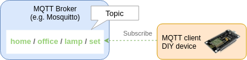
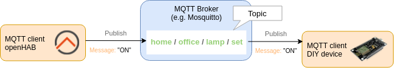
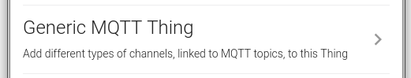
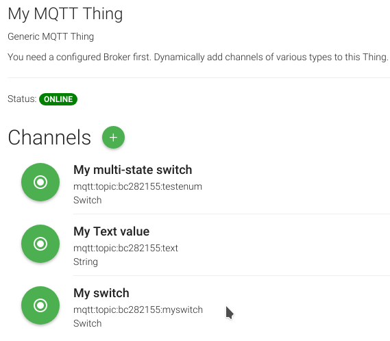

# MQTT Arrives in the Modern openHAB 2.x Architecture

If you haven't heared about MQTT yet, it is probably time to have a [look](https://en.wikipedia.org/wiki/MQTT). Quoting Wikipedia here:

> "MQTT (Message Queuing Telemetry Transport) is an ISO standard (ISO/IEC PRF 20922)[2] publish-subscribe-based messaging protocol. [&hellip;] It is designed for connections with remote locations where a "small code footprint" is required or the network bandwidth is limited.  [&hellip;]
> 
> An MQTT system consists of clients communicating with a server, often called a "broker". A client may be either a publisher of information or a subscriber. Each client can connect to the broker.
> 
> Information is organized in a hierarchy of topics."


In recent years MQTT got a lot of attention for the Internet of Things,
Maker and DIY culture as well as home automation purposes.
Mainly because of its simplicity and its many client and server implementations.

## MQTT in openHAB 1.x and up to 2.3

Let us wrap up a bit of history to understand what has changed.
openHAB had quite powerful MQTT support for its time in the 1.x days.

First you would have defined one or multiple MQTT brokers in a service configuration file.
In a next step some lines like the following would have been added to your *.item* file:

```
Switch mySwitch {mqtt="<[mybroker:home/office/lamp:state:default],>[mybroker:home/office/lamp/set:command:*]"}
```

What you see above is an item, bound to a MQTT topic as the source for the item state.

A command topic is defined for the switch item, used when the switch is turned.
What happens on the MQTT level for the command topic is:

1. The target device **subscribes** to the command topic `home/office/lamp/set`:

2. OpenHAB **publishes** via the MQTT connection to the command topic `home/office/lamp/set`:


MQTT doesn't restrict you on what to publish as topic values and it is not part of the standard how to express a boolean or enumeration value.
Some vendors use xml, some use json structured data and some just send plain strings like *1* or *ON*.

The MQTT binding considered that from the beginning and offered to apply a transformation for received (and published) messages.

If your water meter for example sends JSon encoded data:

```json
{
   device: {
      meters: [
         { value: 2 }
      ]
   }
}
```
Have a look at this corresponding `Number` item, where a JSONPATH is used to extract the value of interest:

`Number waterConsumption "consum [%d]" {mqtt="<[mybroker:myHome/watermeter:state:$.device.meters[0].value]"}`

Unfortunately the MQTT support did not evolve much while openHAB migrated to a new architecture for 2.x.

* It is not possible to use Paper UI at all to define MQTT brokers.
* You can not graphically define MQTT linked Things and Channels.
* And your feedback for a configuration problem narrows down to skimming through log files.

Up until now, where some fundamental changes found their way into the codebase.

## MQTT in openHAB 2.4

The new MQTT architecture has been realized in an easy extensible, modular way.
They different bundles are fully test covered to live up to the high coding standards of the underlying Eclipse Smarthome platform.

I will now take you on a journey of exploring all the new features, arriving soon on your openHAB installation.

First of all, you want to install the new MQTT binding, for example from within Paper UI in the *Addons* section:


The new MQTT binding can coexist with the old MQTT openHAB 1.x binding (but I really do not recommend this setup).

### MQTT Broker

When it comes to MQTT enabled devices, like your WiFi wall plug or custom Arduino or ESP8266 solution,
you first need to take care of a very central aspect, the MQTT broker.

Configuring the MQTT broker connection is so essential for a good MQTT support,
that you can now finally do this in a graphical fashion.

Select the correct Thing to create:


Configure your Broker connection:


To wrap it up: MQTT can be enabled for your network by

1. installing an MQTT broker,
2. configuring an MQTT broker,
3. Adding the Broker Thing and configuring it in Paper UI.

Right?

Actually, it is even simpler. openHAB comes with an embedded MQTT broker now:


All you have to do is, installing the addon in Paper UI to have a working MQTT broker, ready to use.

You can optionally configure the embedded broker in the service section of PaperUI (or via text files as usual):


A new *Broker Connection* appears in your Inbox.
Just add it, no further configuration necessary.

#### Broker Connection Status

A broker connection can fail for many reasons.
May it be wrong credentials, a denied tcp connection (i.e. firewall), a maximum connection limit
or just the wrong IP and Port configuration parameters.

The former MQTT implementation knew about the reason as well,
but at that time could only log any problem.

The reason is now directly presented to you via the Thing status.

This also means, the status is available for the automation rule engine to e.g.
react on a failing broker connection.

### Auto-Discovery

The MQTT standard does not enforce any topic layout or topic value format. 
A smart light vendor can decide to publish his lights under a "vendorname/deviceID/light" MQTT topic
or use a totally different layout like "light/vendorname/deviceid".

People even disagree about the value format, sometimes it is *ON*, sometimes *1* or *true*.

That is why MQTT topic and format conventions got established amongst the DIY IoT community. 
The new MQTT Things extension supports two conventions out-of-the-box:

* The Homie 3.x specification: This vender neutral MQTT convention defines the layout of MQTT topics and the value format. It allows a full device capabilities discovery. 
* The HomeAssistant MQTT Components specification: Some common components like a Light, a Switch, a Fan, an Air-Conditioner and so on are defined. More generic device capabilities cannot be expressed via this convention.

Because the topic structure of a convention is known,
the MQTT Things extension is able to provide auto-discovery and mapping of MQTT topics to openHAB Things and Channels.


If you setup your next DIY Home-Automation gadget, consider flashing it with a *Homie 3.x* compatible firmware and it will work with openHAB right away.

### MQTT Things

It cannot be stressed enough, to consider changing existing MQTT client devices to a MQTT convention like the mentioned *Homie 3.x* convention.
That might not be possible in some cases though. 

It is always possible to create a manual MQTT Thing:




By adding Channels to your Thing, you actually bind MQTT topics to your OpenHAB world.



The following channel types are supported:

| Type          | Parameters     | Description                                                                                |
|---------------|----------------|--------------------------------------------------------------------------------------------|
| String        |                | Shows the received text on the given topic and send text to a given topic.                 |
| Number        | min, max       | Shows the received number on the given topic and send a number to a given topic.           |
| Dimmer        | min, max, step | Handles numeric values as percentages.                                                     |
| Contact       |                | This channel represents a open/close state of a given topic.                               |
| Switch        | custom on/off  | Represents an on/off state of a given topic and can send an on/off value to a given topic. |
| Color RGB/HSB | custom on/off  | Handles color values in RGB / HSB format.                                                  |
| DateTime      |                | This channel handles date/time values.                                                     |
| Image         |                | This channel handles binary images in common java supported formats (bmp,jpg,png).         |
| Location      |                | This channel handles a location.                                                           |

Each channel supports a transformation pattern to extract a state from a structured response like JSON.
An example would be the pattern `JSONPATH:$.device.status.temperature` for an
incoming MQTT message of `{device: {status: { temperature: 23.2 }}}`.

### Configuration via Text Files

You find all examples in the blog post performed via Paper UI.
You can of course still setup every aspect via text files,
like in the following examples.

*broker.thing* file:
```
mqtt:broker:mySecureBroker [ host="192.168.0.41", secure=true, certificatepin=true, publickeypin=true ]
mqtt:broker:myUnsecureBroker [ host="192.168.0.42", secure=false ]

mqtt:broker:myAuthentificatedBroker [ host="192.168.0.43",secure=true, username="user", password="password" ]

mqtt:broker:pinToPublicKey [ host="192.168.0.44", secure=true , publickeypin=true, publickey="SHA-256:9a6f30e67ae9723579da2575c35daf7da3b370b04ac0bde031f5e1f5e4617eb8" ]
```

* In a first example a very secure connection to a broker is defined. It pins the returned certificate and public key. If someone tries a man in the middle attack later on, this broker connection will recognize it and refuse a connection. Be aware that if your brokers certificate changes, you need to remove the connection entry and add it again. 
* The second connection is a plain, unsecured one. Use this only for local MQTT Brokers.
* A third connection uses a username and password for authentication. The credentials are plain values on the wire, therefore you should only use this on a secure connection.
* In a forth connection, the public key pinning is enabled again. This time, a public key hash is provided to pin the connection to a specific server. It follows the form "hashname:hashvalue". Valid hashnames are SHA-1, SHA-224, SHA-256, SHA-384, SHA-512 and all others listed in Java MessageDigest Algorithms.

*mqtt.thing* file:

```
Bridge mqtt:broker:myUnsecureBroker [ host="192.168.0.42", secure=false ]
{
    Thing mqtt:topic:mything {
    Channels:
        Type switch : lamp "Kitchen Lamp" [ mqttstate="lamp/enabled", mqttcommand="lamp/enabled/set" ]
        Type switch : fancylamp "Fancy Lamp" [ mqttstate="fancy/lamp/state", mqttcommand="fancy/lamp/command", on="i-am-on", off="i-am-off" ]
        Type string : alarmpanel "Alarm system" [ mqttstate="alarm/panel/state", mqttcommand="alarm/panel/set", allowedStates="ARMED_HOME,ARMED_AWAY,UNARMED" ]
        Type color : lampcolor "Kitchen Lamp color" [ mqttstate="lamp/color", mqttcommand="lamp/color/set", rgb=true ]
        Type dimmer : blind "Blind" [ mqttstate="blind/state", mqttcommand="blind/set", min=0, max=5, step=1 ]
    }
}
```

In the given example an unsecure broker connection is defined with a *Generic MQTT Thing* that has 5 channels added.

#### System Broker Connections

For openHAB distributors it is crucial to be able to pre-configure openHAB
to offer a seamless integration of pre-installed extensions and
other 3rd-party software like an MQTT broker.

Like in the versions before, if you pre-install an MQTT broker like Mosquitto,
you can tell openHAB about it via a service configuration file.

Instead of populating an "mqtt.conf" file, you are now creating an "etc/whatever-name.cfg"
file that contains the following lines:

```
service.pid="org.eclipse.smarthome.mqttbroker"
name="A mosquitto local installation"
username="username"
password="password"
clientID="localClient123"
host="127.0.0.1"
secure=true
```

Those pre-defined connections are called system broker connections.

By the way, this is the equivalence of using Paper UI for configuring the MQTT managed connections service:


Be aware that this adds the broker to the Inbox, but does not create a Broker Thing on its own.

## Conclusion

The new MQTT bindings allow an easy point and click configuration to include your
MQTT capable device into openHAB. If your device follows any supported MQTT convention,
it got even simpler with full auto-discovery of all device capabilities. At the same
time all advanced requirements that the community brought up during development,
could be considered.

This is a contribution by an external author, and I feel the need to talk a few seconds about my motivation.

I think, that a home-automation framework should be simple to configure.
I'm talking about a graphical interface to install, enable and disable plugins,
to setup plugins in a graphical fashion and to control provided functionality
right after everything was configured.

That is why I got caught by the openHAB 2 development, where Paper UI got introduced.
The [community](https://community.openhab.org/) was amazing, super friendly and welcoming
when I asked my first questions on the forum.

The many issues appearing weekly, over and over, with the openHAB 1.x MQTT binding
got me thinking. It was just time that MQTT support arrives in a openHAB 2 compatible fashion.

I am really happy how this support turned out and I hope you will find it as useful as I do and
that MQTT feels like a first class citizen now.

If you have any comments on how we as a community can improve the support or covering even more use-cases,
head over to the [discussion forum](https://community.openhab.org/).

Cheers,
David Graeff
